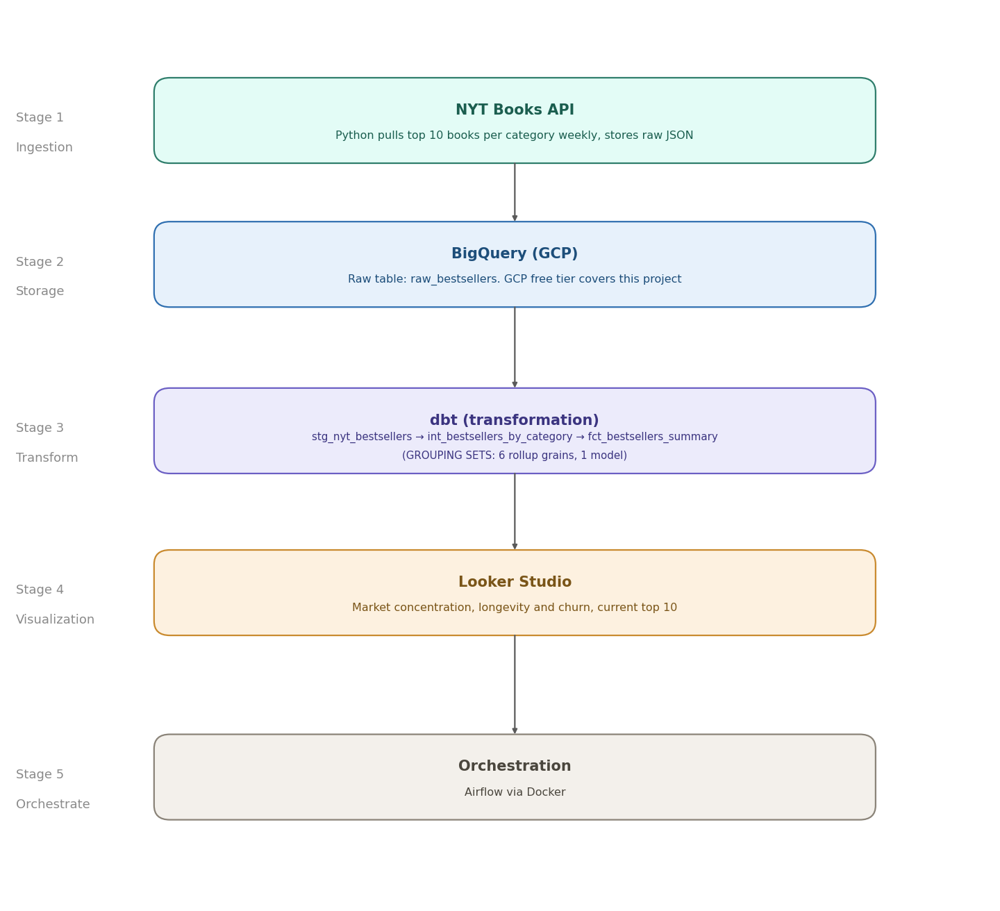

# NYT Bestsellers Data Pipeline

A data engineering project that extracts weekly bestseller data from the New York Times Books API, loads it into BigQuery, transforms it with dbt, and surfaces market concentration and longevity trends in a Looker Studio dashboard.

Built as a portfolio project to demonstrate a production-style data pipeline using modern DE tooling.

---

## Project Overview

Publishing companies employ people who specialize in specific book categories like fiction editors, nonfiction editors, young adult editors, and so on. This project simulates an internal data tool for a publisher: a pipeline that tracks the weekly NYT bestseller lists and turns them into the questions a category specialist actually asks. Which publishers and authors dominate my segment? How long do titles survive on the list? What is new this week?

**The problem it solves:** the NYT publishes rankings weekly but keeps no history. Without somewhere to accumulate snapshots you cannot answer anything longitudinal, such as how concentrated a category is, or whether a title is climbing or fading. This pipeline builds that history and makes it queryable.

---

## Architecture

---

## Dashboard

[View the live Looker Studio dashboard](https://datastudio.google.com/u/1/reporting/437eb67d-f3b2-40b0-b2bd-a24335664ca0/page/bvmvF)

Three pages built on top of `fct_bestsellers_summary`:
- **Market Concentration**: which publishers and authors dominate the bestseller lists
- **Longevity & Churn**: how long bestsellers stay on the list, and where new entries push out long-running titles
- **Current Top 10**: the most recent week's top 10 books per category

---

## Tech Stack

| Layer | Tool | Purpose |
|---|---|---|
| Ingestion | Python, pynytimes | Extract data from NYT Books API |
| Storage | BigQuery (GCP) | Cloud data warehouse |
| Transformation | dbt | Staging, intermediate, and mart models |
| Visualization | Looker Studio | Dashboard connected to BigQuery |
| Orchestration | Airflow via Docker | Weekly pipeline orchestration |
| Environment | python-dotenv | Credential management |

---

## Project Status

- [x] Stage 1: Ingestion. Python script pulls 5 NYT categories into BigQuery
- [x] Stage 2: Transformation. dbt models (staging, intermediate, marts) with data quality tests
- [x] Stage 3: Dashboard. Looker Studio on BigQuery mart tables
- [x] Stage 4: Orchestration. Apache Airflow DAG, scheduled weekly for Thursdays at 00:00 America/New_York

---

## Known issues / Lessons learned

**Append-only ingestion was not idempotent.** `ingest_nyt.py` originally used BigQuery's streaming insert with no deduplication. When a stuck Airflow task was re-released alongside a manual retry, the same week's bestseller list landed in `raw_bestsellers` twice. Cleanup meant a one-time `DELETE` that could not run until BigQuery's streaming buffer flushed, about 2 hours later.

Fixed in three layers:

- **Ingestion** uses an atomic load job instead of a streaming insert. The batch lands completely or not at all, and rows are immediately available to DML, so a bad run can be corrected right away instead of after a buffer delay.
- **Staging** deduplicates to the model's real grain, one row per `(pulled_date, list_name, rank)`, keeping the most recent pull.
- **A `unique` test** on a surrogate key over that grain fails the build if duplicates ever reappear, instead of the numbers quietly doubling in the mart's counts and share-of-voice percentages.

**Silent failures produced green DAG runs.** The ingestion script caught per-category API errors, printed them, and exited 0, so a failed load or a total API outage still marked the Airflow task successful and left the dashboard serving stale data with no signal. The script now raises if any category fails to fetch or if the BigQuery load errors. A partial week is treated as a failure rather than accepted, because an incomplete pull would still compute grand totals and share-of-voice percentages, just over wrong data.

---

## About

Built by Elena Tarasova, Data Analyst & Analytics Engineer based in Montreal.  
GitHub: https://github.com/tarasovaelena  
LinkedIn: https://www.linkedin.com/in/iamtarasova/
