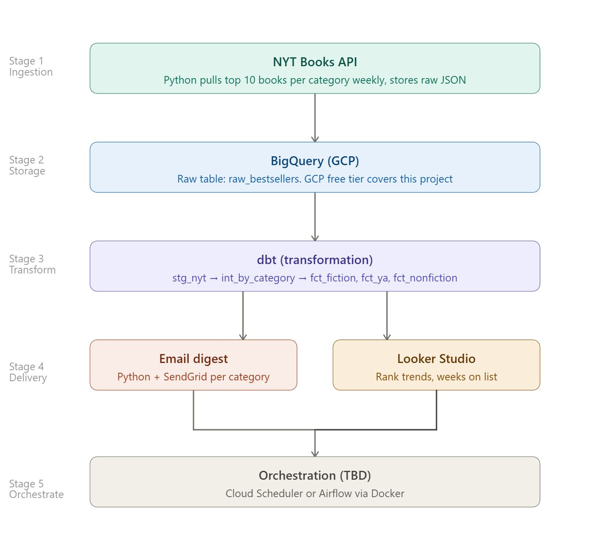

# NYT Bestsellers Data Pipeline

A data engineering project that extracts weekly bestseller data from the New York Times Books API, loads it into BigQuery, transforms it with dbt, and delivers category-specific email digests to subscribers.

Built as a portfolio project to demonstrate a production-style data pipeline using modern DE tooling.

---

## Project Overview

Publishing companies employ people who specialize in specific book categories — fiction editors, nonfiction editors, young adult editors, and so on. This project simulates an internal data tool for a publisher: a pipeline that pulls the weekly NYT bestseller lists and delivers each department only the rankings relevant to their work.

**The problem it solves:** Instead of manually checking the NYT website every week, the right people get the right data automatically, on schedule, in their inbox.

---

## Architecture

---

## Tech Stack

| Layer | Tool | Purpose |
|---|---|---|
| Ingestion | Python, pynytimes | Extract data from NYT Books API |
| Storage | BigQuery (GCP) | Cloud data warehouse |
| Transformation | dbt | Staging, intermediate, and mart models |
| Delivery | Python, SendGrid | Automated email digests per category |
| Visualization | Looker Studio | Dashboard connected to BigQuery |
| Orchestration | Cloud Scheduler | Weekly pipeline trigger |
| Environment | python-dotenv | Credential management |

---

## Project Status

- [x] Stage 1: Ingestion — Python script pulls 5 NYT categories into BigQuery
- [x] Stage 2: Transformation — dbt models (staging, intermediate, marts) with data quality tests
- [ ] Stage 3: Email delivery — per-subscriber category digest
- [ ] Stage 4: Dashboard — Looker Studio on BigQuery mart tables
- [ ] Stage 5: Orchestration — Cloud Scheduler weekly trigger

---

## About

Built by Elena Tarasova, Data Analyst & Analytics Engineer based in Montreal.
GitHub: https://github.com/tarasovaelena 
LinkedIn: https://www.linkedin.com/in/iamtarasova/
